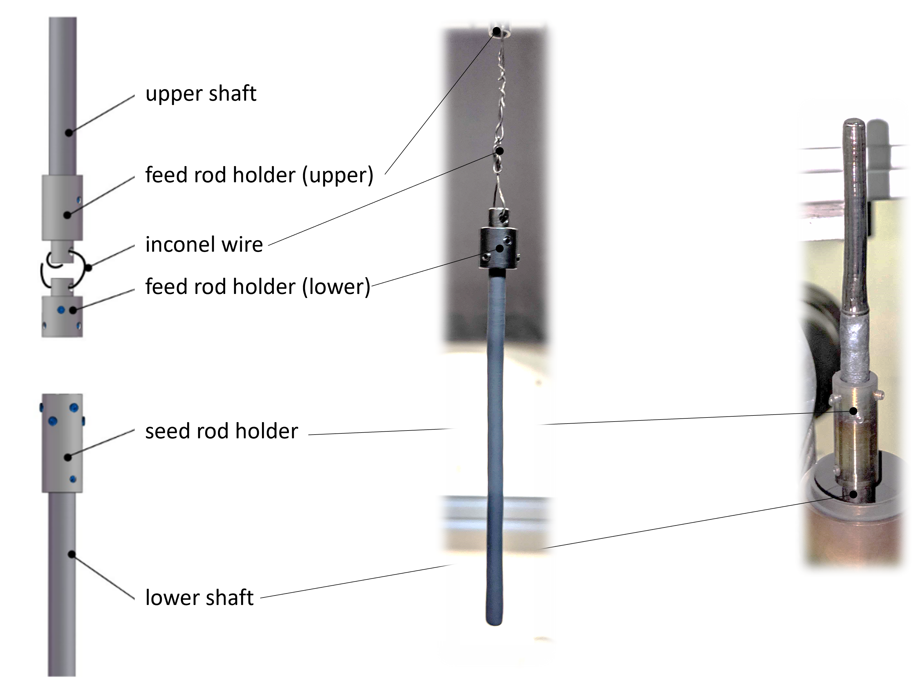
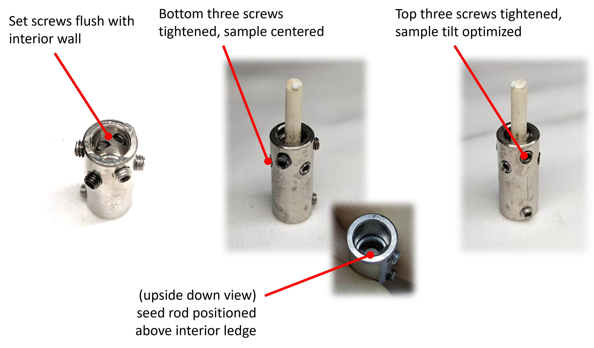

# Sample mounting and alignment

## Seed rod

### Mounting

1. Insert the six mounting set screws at the top of the seed rod holder, enough so that they are flush with the inner cylindrical surface.

1. Place the seed rod into the seed rod holder and tighten the bottom three mounting set screws in equal increments (~1/4 turn of the Alan key).
	- Care should be taken to keep the sample centered within the mount, though slight tilts are allowable at this point and may be corrected later using the other three mounting set screws.
	- The bottom of the seed rod must be above the interior ledge within the seed rod holder. This ledge rests atop the translator shaft - otherwise the seed rod itself will collide with the translator shaft first, and this can cause damage to the seed rod.
1. Tighten the top three set screws until they are gently touching the seed rod.

### Alignment

Assess and correct the precession of the seed rod - this can be done in any way you see fit, but the following technique is recommended:

1. Place the seed rod holder onto the bottom translator shaft and affix using the single set screw on the bottom of the seed holder.
1. Slide the bottom translator housing up so that the inconel adapter is flush with the bottom of the chamber.
1. Turn the aiming beam on.
1. With rotation enabled, use the `Fast Gear` to translate the **tip of the seed rod** into the beam.
1. Allow the sample to rotate in the beam and use tape to mark the maximum leftward and rightward positions of the seed rod.
1. Stop the rotation at the moment when the rod is at the rightmost (or leftmost) position.
1. Slide the bottom translator housing down so that the sample is accessible.
1. Identify the direction in which the rod is tilted, based on whether it was at the rightmost or leftmost extreme. ***Keep track of this direction as you remove the sample from the shaft.***
1. Gently **loosen** the screws opposite the direction of the unwanted displacement, and then gently **tighten** the screws that lie along the direction of the unwanted displacment to remedy it.
1. Replace the seed rod onto the shaft and repeat until precession at the tip of the rod has been eliminated.

## Feed rod

The feed rod is mounted in essentially the same manner as the seed rod. However, the standard for minimizing precession using the mounting set screws is not as critical here, as minor adjustments can be made by manipulating the bend of the wire.