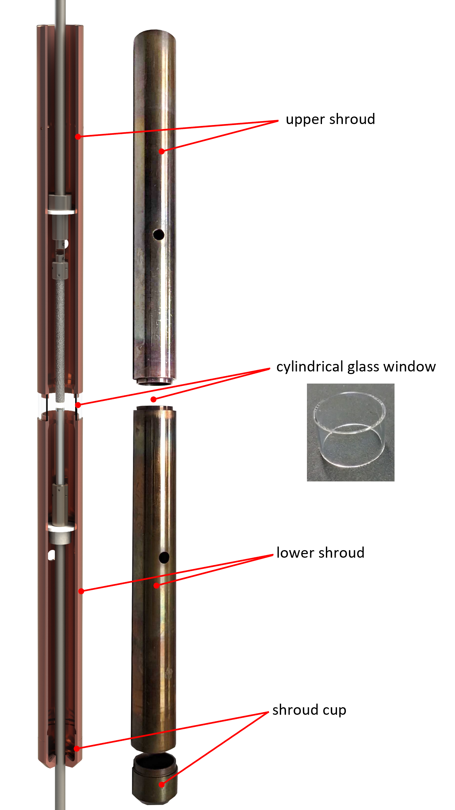

# Heat and chemical shield ("shroud")

{width="300" align="right"}

## Shroud design

The volatilization of material during growth cannot be completely mitigated by the application of high pressure, warranting the use of a heat and chemical shield to protect the chamber walls and windows from material ejected out of the molten zone. This is accomplished using a copper-beryllium (CuBe) shroud which consists of a shroud cup, lower shroud piece, cylindrical window, and upper shroud piece.

**Shroud cup**: The shroud cup sits at the very bottom of the lower inconel adapter, and is meant to prevent material entering into the neck of the pressure tube of the lower translator. It is also useful for catching bits of crystals that have fallen down after growth. The cup has a hole in the center to allow the translator shaft to pass through it, and because this hole has a relatively large diameter a stainless steel collar is usually placed around the translator shaft just on top of the shroud cup to limit powder falling into this gap.

**Lower shroud**: The lower shroud piece

## Shroud windows
- Expensive one
- Not so expensive one
## Assembling the shroud